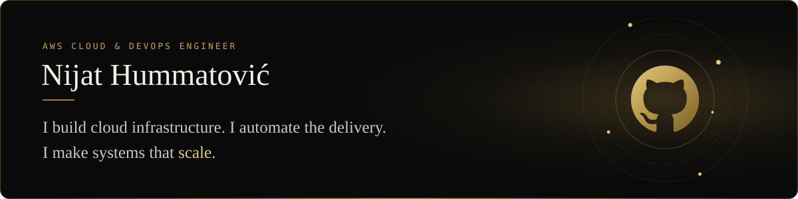
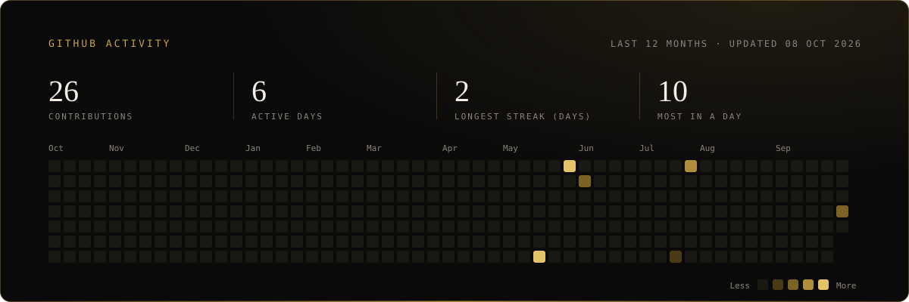

---

## About me

I'm an AWS Cloud & DevOps engineer with 3+ years of experience across 30+ enterprise AWS environments. My work is about cutting cloud costs, shortening release cycles and keeping systems resilient, using Infrastructure as Code, CI/CD and event-driven automation. I've also run production workloads on Azure.

I work by one simple rule: if a task keeps coming back, it should be automated. That applies to provisioning, deployments, and database operations on both relational and NoSQL systems.

**What I work on**

- **Infrastructure as Code**: designing and maintaining cloud environments with Terraform
- **Kubernetes**: deploying and operating containerised workloads
- **CI/CD**: building pipelines with GitHub Actions and Jenkins that take code safely to production
- **Cloud architecture**: AWS and Azure environments designed for reliability and cost efficiency
- **Event-driven automation**: replacing manual operations with automated, event-triggered workflows
- **Databases**: day-to-day operations on PostgreSQL, MySQL, DynamoDB and MongoDB

**Right now**

- Building new tooling under [Douklar](https://github.com/douklar)
- Open to collaborating on DevOps automation, cloud infrastructure and IaC projects
- Always happy to talk Terraform, Kubernetes, AWS architecture or CI/CD design

---

## Douklar

I founded **[Douklar](https://github.com/douklar)** to take the repetitive work out of DevOps. It's a collection of open-source and private tools covering the whole DevOps lifecycle, and it isn't tied to any single cloud or platform.

---

## Certifications

| Certification | Issuer |
| --- | --- |
| AWS Certified DevOps Engineer – Professional | Amazon Web Services |
| AWS Certified SysOps Administrator – Associate | Amazon Web Services |
| Microsoft Certified: Azure Solutions Architect Expert (AZ-305) | Microsoft |
| Microsoft Certified: Azure Administrator Associate (AZ-104) | Microsoft |
| Certified Kubernetes Administrator (CKA) | CNCF / The Linux Foundation |
| Certified Kubernetes Application Developer (CKAD) | CNCF / The Linux Foundation |
| HashiCorp Certified: Terraform Associate (003) | HashiCorp |

Click a badge to verify it. The full list is on [Credly](https://www.credly.com/users/hummatovic/badges#other) and [hummatovic.com](https://hummatovic.com).

---

## Tech stack

<table>
  <tr>
    <td><b>Cloud &amp; infrastructure</b></td>
    <td>
      
      
      
      
      
    </td>
  </tr>
  <tr>
    <td><b>CI/CD</b></td>
    <td>
      
      
    </td>
  </tr>
  <tr>
    <td><b>Web servers</b></td>
    <td>
      
      
    </td>
  </tr>
  <tr>
    <td><b>Languages &amp; systems</b></td>
    <td>
      
      
      
    </td>
  </tr>
  <tr>
    <td><b>Databases</b></td>
    <td>
      
      
      
      
    </td>
  </tr>
</table>

---

